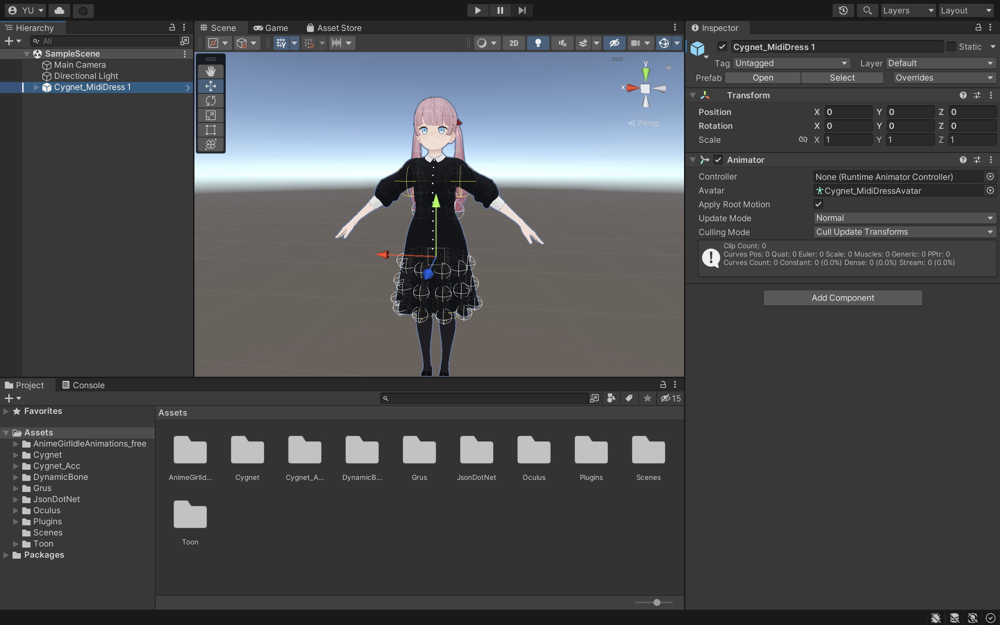
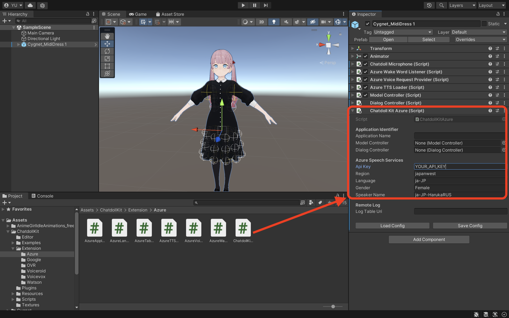
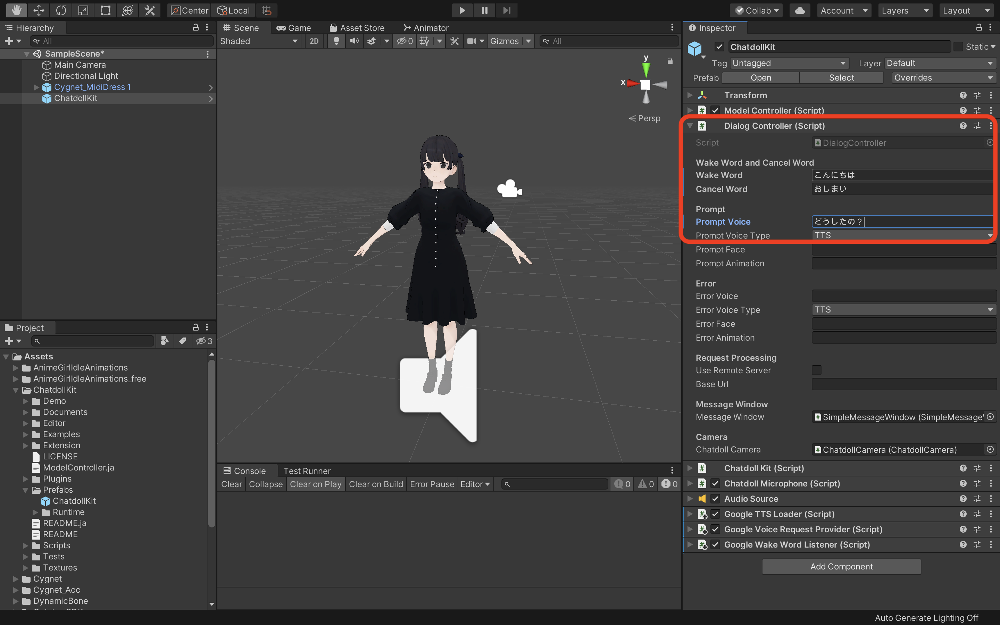
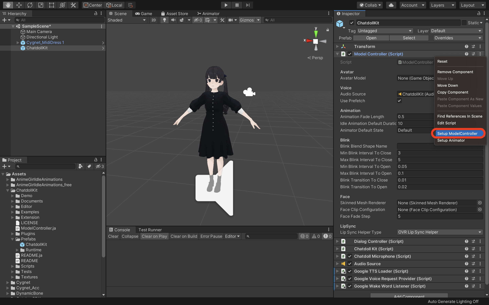
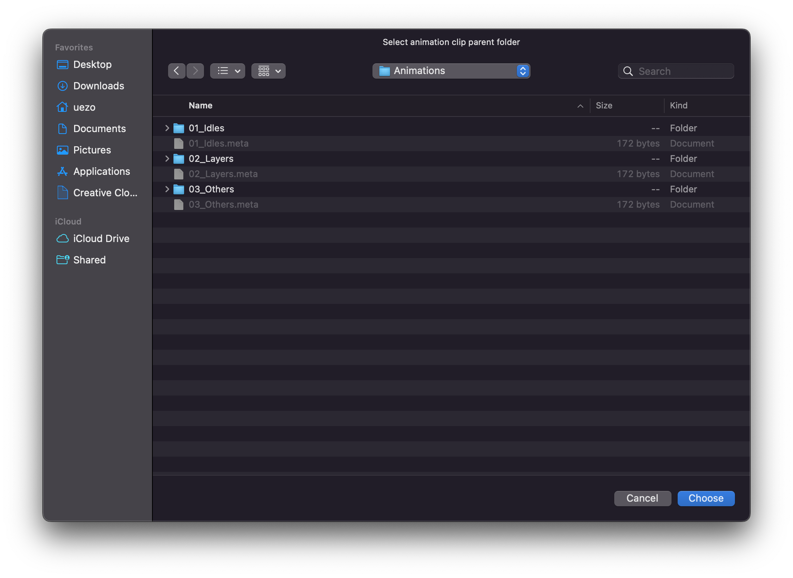
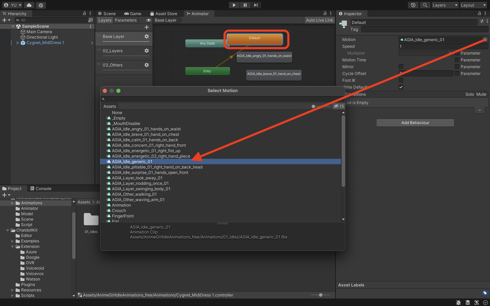

# ChatdollKit
ChatdollKitは、お好みの3Dモデルを使って音声対話可能なチャットボットを作るためのフレームワークです。 [🇬🇧README in English is here](https://github.com/uezo/ChatdollKit/blob/master/README.ja.md)

- [🇯🇵 Live demo in Japanese](https://uezo.blob.core.windows.net/github/chatdollkit/demo_ja/index.html)「こんにちは」と話しかけると会話がスタートします。会話がスタートしたら、雑談に加えて「東京の天気は？」などと聞くと天気予報を教えてくれます。
- [🇬🇧 Live demo English](https://uezo.blob.core.windows.net/github/chatdollkit/demo_en/index.html) Say "Hello" to start conversation. This demo just returns what you say (echo).

# ✨ 主な特長

- モデル制御
    - 発話とアニメーションの同期実行
    - 表情の制御
    - まばたきと口パク

- 対話制御
    - 音声認識（Speech-to-Text。Azure、Google、Watson等）
    - テキスト読み上げ（Text-to-Speech。Azure、Google、Watson、VOICEROID、VOICEVOX等）
    - 対話の文脈・ステート管理
    - 発話意図の抽出と対話トピックのルーティング

- 入出力
    - ウェイクワードによる起動
    - カメラとQRコードリーダー

... などなど！
本READMEのほか、[ChatdollKit マニュアル](Documents/manual.ja.md)に各機能の網羅的な説明がありますので参照ください。

# 🚀 クイックスタート

セットアップ手順についてはこちらの2分程度の動画をご覧いただくとより簡単に理解できます: https://www.youtube.com/watch?v=aJ0iDZ0o4Es

## 📦 パッケージのインポート

最新版の [ChatdollKit.unitypackage](https://github.com/uezo/ChatdollKit/releases) をダウンロードして、任意のUnityプロジェクトにインポートしてください。また、以下の依存ライブラリもインポートが必要です。

- [UniTask](https://github.com/Cysharp/UniTask)(Ver.2.3.1)
- [Oculus LipSync Unity](https://developer.oculus.com/downloads/package/oculus-lipsync-unity/)(v29)
- Unity 2019以前の場合のみ [JSON .NET For Unity](https://assetstore.unity.com/packages/tools/input-management/json-net-for-unity-11347)
- [Gatebox](https://www.gatebox.ai/)アプリを作る場合、ChatdollKitのリリースパッケージと一緒に公開されている[ChatdollKit Gatebox Extension](https://github.com/uezo/ChatdollKit/releases)もインポートしてください。

## 🐟 リソースの準備

お好みの3Dモデルをシーンに配置してください。シェーダーやダイナミックボーンなど必要に応じてセットアップしておいてください。なおこの手順で使っているモデルはシグネットちゃんです。とてもかわいいですね。 https://booth.pm/ja/items/1870320

また、`/Animations`ディレクトリを作成し、アニメーションクリップを配置してください。
なおこの手順では[Anime Girls Idle Animations Free](https://assetstore.unity.com/packages/3d/animations/anime-girl-idle-animations-free-150406)というモーション集を利用しています。大変使い勝手が良いので気に入ったら有償版の購入をオススメします。

## 🍣 ChatdollKitの設定

`ChatdollKit/Scripts/ChatdollKit` を3Dモデルに追加してください。アニメーション、音声、表情をコントロールする`ModelController`やその他必要なコンポーネントが合わせて追加されます。
また、`ChatdollKit`のインスペクター上で音声認識・読み上げサービス（Azure/Google/Watson）を選択し、APIキーなど必要な情報を入力してください。

### DialogControllerの設定

`DialogController`のインスペクターで、会話を開始する合図となる `Wake Word`、会話を終了する合図となる `Cancel Word`、ユーザーからのリクエストを受け付けるための `Prompt Voice` を設定します。

### ModelControllerの設定

インスペクターのコンテキストメニューから`Setup ModelController`を選択すると、LipSync等が自動的に設定されます。セットアップ後、`Blink Blend Shape Name`に値が設定されていない場合は、目を閉じるためのシェイプキーの名前を入力してください。これらの手順をすべて手動で行うには [Appendix1. ModelControllerの手動設定](Documents/appendix.ja.md#appendix-1-modelcontrollerの手動設定) を参照してください。

### Animatorの設定

インスペクターのコンテキストメニューから`Setup Animator`を選択するとフォルダ選択ダイアログが表示されるので、アニメーションクリップが配置されたフォルダを選択してください。サブフォルダが含まれる場合、それらと同名のレイヤーが`AnimatorController`に作成され、サブフォルダ内のアニメーションクリップはそのレイヤーに配置されます。

このケースでは、フォルダを選択したのちにベースレイヤー（`Base Layer`）またはそれぞれのレイヤー（`01_Idles`、`02_Layers`、`03_Others`）に配置するか確認ダイアログが表示され、配置先を選択することができます。

`AnimatorController`の自動生成が終わったら、デフォルトのアイドルアニメーションを変更したい場合はアニメーターコントローラーの`Default`ステートに紐づけられたアニメーションクリップを変更しましょう。

これらの手順を手動で行うには、[Appendix2. Animatorの手動設定](Documents/appendix.ja.md#appendix-2-animatorの手動設定) を参照してください。

## 🥳 動作確認

UnityのPlayボタンを押します。3Dモデルがまばたきをしながらアイドル時のアニメーションを行っていることが確認できたら、以下のように会話をしてみましょう。

- `Wake Word`に設定した文言を話しかける（例：こんにちは）
- `Prompt Voice`に設定した文言で応答（例：どうしたの？）
- 話しかけたい言葉をしゃべる（例：これはテストです）
- 話しかけた言葉と同じ内容を応答

# 👷‍♀️ カスタムアプリケーションの作り方

Examplesに同梱の`MultiSkills`の実装サンプルを参考にしてください。

- 対話のルーティング：`Router`には、発話内容からユーザーが話したいトピックを選択するロジックの例が実装されています
- 対話の処理：`TranslateDialog`をみると、リクエスト文言を利用して翻訳APIを叩き、結果を応答する一連の例が実装されています

ChatdollKitを利用した複雑で実用的なバーチャルアシスタントの開発方法については、現在コンテンツを準備中です。

# 🌐 WebGLでの実行

さしあたっては以下のTipsを参考にしてください。加えてWebGL用のデモを公開予定です。

- ビルドに5-10分くらいかかる。（マシンスペックによる）
- デバッグがとても大変。どこでエラーが起きたのか、ログには表示されない: `To use dlopen, you need to use Emscripten’s linking support, see https://github.com/kripken/emscripten/wiki/Linking` 
- C#標準の Async/Await が利用できない（そこでコードが止まる）。JavaScriptがシングルスレッドなことに依存していると思われる。かわりに [UniTask](https://github.com/Cysharp/UniTask) を利用しましょう
- WebGLアプリのホスト先と異なるドメインとHTTP通信するにはCORSへの対応が必要
- Unity標準のマイクは動作しない。ネイティブ・WebGL双方で意識せず利用できる`ChatdollMicrophone`を使いましょう
- MP3などの圧縮音源の再生ができない。TTSLoader（読み上げ）のフォーマットをWaveにしましょう
- OVRLipSyncが動作しない。かわりに [uLipSync](https://github.com/hecomi/uLipSync) と [uLipSyncWebGL](https://github.com/uezo/uLipSyncWebGL) との組み合わせを使いましょう
- 日本語等のマルチバイト文字を表示したいとき、それが含まれるフォントをプロジェクトに同梱する必要がある。メッセージウィンドウが標準でArialなので、これをM+など別のものに変更しましょう

# ❤️ 謝辞

ChatdollKitでは以下のすばらしい素材・ツールを利用させていただいており、心から感謝申し上げます。

- [つくよみちゃん 3Dモデル](https://tyc.rei-yumesaki.net/) (3D model for demo) (c)[Rei Yumesaki](https://twitter.com/TYC_Project)
- [VOICEVOX](https://voicevox.hiroshiba.jp) (Text-to-Speech service for demo) (c)[Hiroshiba](https://twitter.com/hiho_karuta)
- [四国めたん ＆ ずんだもん](https://zunko.jp/con_voice.html) (Voice for demo, used in VOICEVOX TTS loader)

ご利用にあたっては[ずんだもん、四国めたん音源利用規約](https://zunko.jp/con_ongen_kiyaku.html)を遵守ください。また、もし生成された音声を配布する場合、配布先にも利用規約を遵守させるよう徹底ください。
