# ChatdollKit
ChatdollKitは、お好みの3Dモデルを使って音声対話可能なチャットボットを作るためのフレームワークです。 [🇬🇧README in English is here](https://github.com/uezo/ChatdollKit/blob/master/README.ja.md)

- [🍎 iOS App: おしゃべりAI](https://apps.apple.com/ja/app/oshaberiai/id6446883638) プロンプトでキャラメイク×VRMでお好みの3Dモデル×VOICEVOXでお好みの声でおしゃべりできるバーチャルエージェントアプリ。ChatdollKitで開発。
- [🇯🇵 Live demo in Japanese](https://unagiken.com/chatdollkit/playground/index.html) OpenAI API Keyをご用意ください。「こんにちは」と話しかけると会話がスタートします。
- [🇬🇧 Live demo English](https://uezo.blob.core.windows.net/github/chatdollkit/demo_en/index.html) Say "Hello" to start conversation. This demo just returns what you say (echo).


# ✨ 主な特長

- モデル制御
    - 発話とアニメーションの同期実行
    - 表情の制御
    - まばたきと口パク

- Generative AI
    - マルチLLM: ChatGPT / Azure OpenAI Service, Anthropic Claude, Google Gemini Pro and others
    - Agents: Function Calling (ChatGPT / Gemini) or your prompt engineering
    - マルチモーダル: GPT-4V and Gemini-Pro-Visionに対応
    - 感情表現: Autonomous face expression and animation

- 対話制御
    - 音声認識・テキスト読み上げ（OpenAI、Azure、Google、Watson、VOICEROID、VOICEVOX等）
    - 対話の文脈・ステート管理（生成AIではコンテキスト、メモリー管理も含む）
    - 発話意図の抽出と対話トピックのルーティング

- 入出力
    - ウェイクワードによる起動
    - カメラとQRコードリーダー

- プラットフォーム
    - Windows / Mac / Linux / iOS / Android and anywhere Unity supports
    - VR / AR / WebGL / Gatebox

... などなど！
本READMEのほか、[ChatdollKit マニュアル](Documents/manual.ja.md)に各機能の網羅的な説明がありますので参照ください。

# 🚀 クイックスタート

セットアップ手順についてはこちらの動画をご覧いただくとより簡単に理解できます。ChatGPTと会話するデモシーンを動かせるまでの手順です: https://www.youtube.com/watch?v=rRtm18QSJtc

[](https://www.youtube.com/watch?v=rRtm18QSJtc)

## 📦 パッケージのインポート

最新版の [ChatdollKit.unitypackage](https://github.com/uezo/ChatdollKit/releases) をダウンロードして、任意のUnityプロジェクトにインポートしてください。また、以下の依存ライブラリもインポートが必要です。

- `Burst` from Unity Package Manager (Window > Package Manager)
- [UniTask](https://github.com/Cysharp/UniTask)(Ver.2.3.1)
- [uLipSync](https://github.com/hecomi/uLipSync)(v2.6.1)
- For VRM model: [UniVRM](https://github.com/vrm-c/UniVRM/releases/tag/v0.89.0)(v0.89.0) and [VRM Extension](https://github.com/uezo/ChatdollKit/releases)
- JSON.NET: プロジェクトにない場合は Package Manager > [+] > Add package from git URL... > com.unity.nuget.newtonsoft-json から追加
- [Azure Speech SDK](https://learn.microsoft.com/ja-jp/azure/ai-services/speech-service/quickstarts/setup-platform?pivots=programming-language-csharp&tabs=macos%2Cubuntu%2Cdotnetcli%2Cunity%2Cjre%2Cmaven%2Cnodejs%2Cmac%2Cpypi#install-the-speech-sdk-for-unity): (Optional) ストリームによるリアルタイム音声認識を行う場合には必要

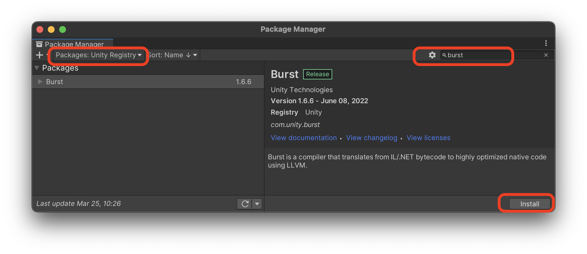


## 🐟 リソースの準備

お好みの3Dモデルをシーンに配置してください。シェーダーやダイナミックボーンなど必要に応じてセットアップしておいてください。なおこの手順で使っているモデルはシグネットちゃんです。とてもかわいいですね。 https://booth.pm/ja/items/1870320

ここでアニメーションクリップを配置しておきましょう。この手順では[Anime Girls Idle Animations Free](https://assetstore.unity.com/packages/3d/animations/anime-girl-idle-animations-free-150406)というモーション集を利用しています。大変使い勝手が良いので気に入ったら有償版の購入をオススメします。


## 🎁 ChatdollKitプレファブの配置

ChatdollKit/Prefabs/ChatdollKit` または `ChatdollKit/Prefabs/ChatdollKitVRM` をシーンに配置します。また、UI操作のための EventSystem もあわせて追加してください。

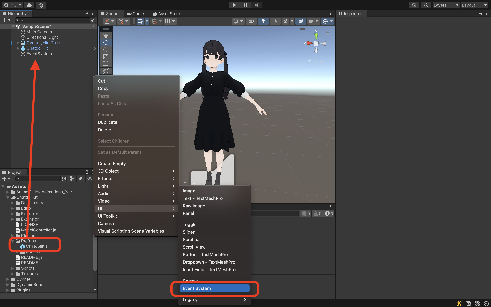


## 🐈 ModelController

ModelControllerのコンテキストメニューから `Setup ModelController` を選択してください。VRM*以外の*モデルを使用している場合、選択後にまばたき用のシェイプキーが `Blink Blend Shape Name` に設定されているか確認しましょう。誤っていたり設定されていない場合は手動で設定してください。

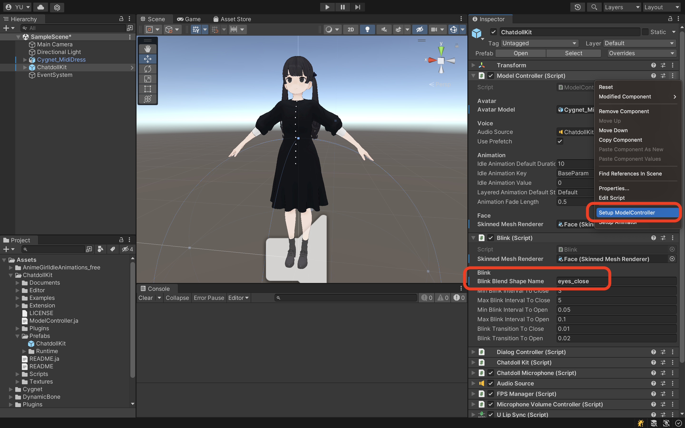


## 💃 Animator

ModelControllerのコンテキストメニューから `Setup Animator` を選択してください。ダイアログが表示されたら、アニメーションクリップの保存先またはその親フォルダを選択します。この動画の例では、`01_Idles` と `03_Others` をメインの `Base Layer` に、 `02_Layers` を合成用の `Additive Layer` に配置しています。


続いて、新たに作成されたAnimatorControllerを開いて `Base Layer` の中からアイドル時の動作に使用したいアニメーションを選びます。また、AnyStateからそのアニメーションに遷移する条件となるパラメーターの値を調べます。

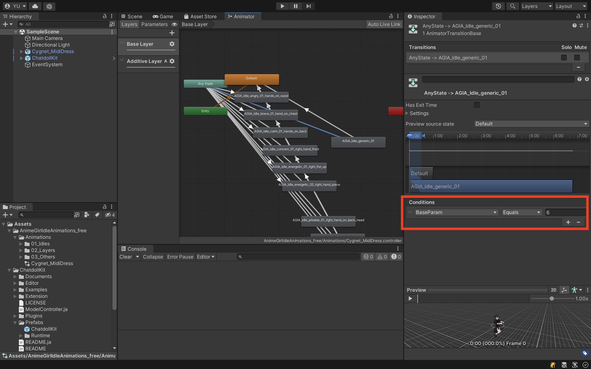

最後に、控えた値をModelControllerのインスペクターにある `Idle Animation Value` に設定します。

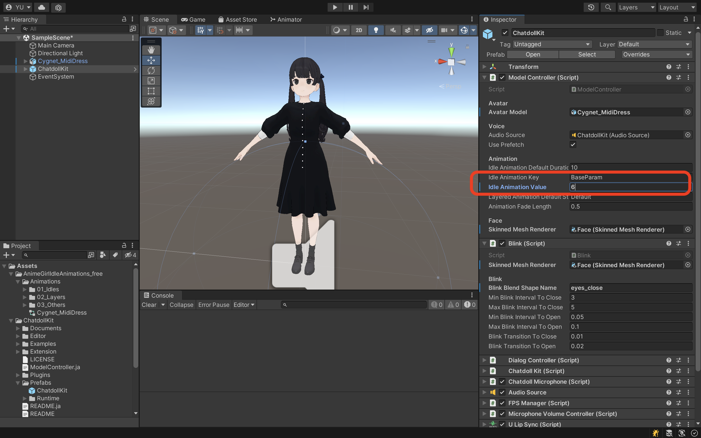


## 🦜 DialogController

`DialogController`のインスペクターで、会話を開始する合図となる `Wake Word` (e.g. こんにちは)、会話を終了する合図となる `Cancel Word` (e.g. おしまい)、ユーザーからのリクエストを受け付けるための `Prompt Voice` (e.g. どうしたの？) を設定します。

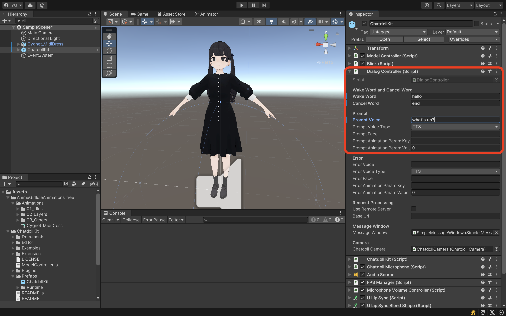


## 🍣 ChatdollKit

`ChatdollKit`のインスペクター上で音声認識・読み上げサービス（OpenAI/Azure/Google/Watson）を選択し、APIキーなど必要な情報を入力してください。

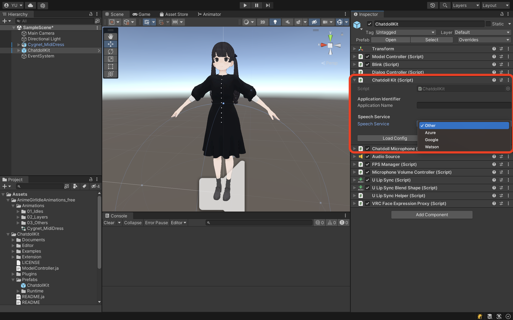


## 🍳 Skill

`ChatdollKit` におうむ返しスキルの `Examples/Echo/Skills/EchoSkill` を追加します。または、もしAIとの会話を今すぐ楽しみたいときは、以下のコンポーネントを追加して `ChatGPTService` にOpenAI API Keyを設定しましょう。

- ChatdollKit/Scripts/LLM/ChatGPT/ChatGPTService
- ChatdollKit/Scripts/LLM/LLMRouter
- ChatdollKit/Scripts/LLM/LLMContentSkill

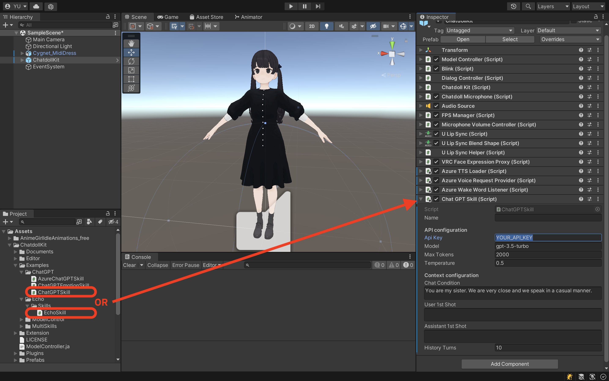


## 🤗 Face Expression (VRM*以外*の場合のみ)

VRC FaceExpression Proxyのコンテキストメニューから `Setup VRC FaceExpression Proxy` を選択します。表情シェイプキーのすべての値がゼロのNeutral, Joy, Angry, Sorrow, Funと、まばたき用のシェイプキーの値のみ100が設定されたBlinkが表情として登録されます。

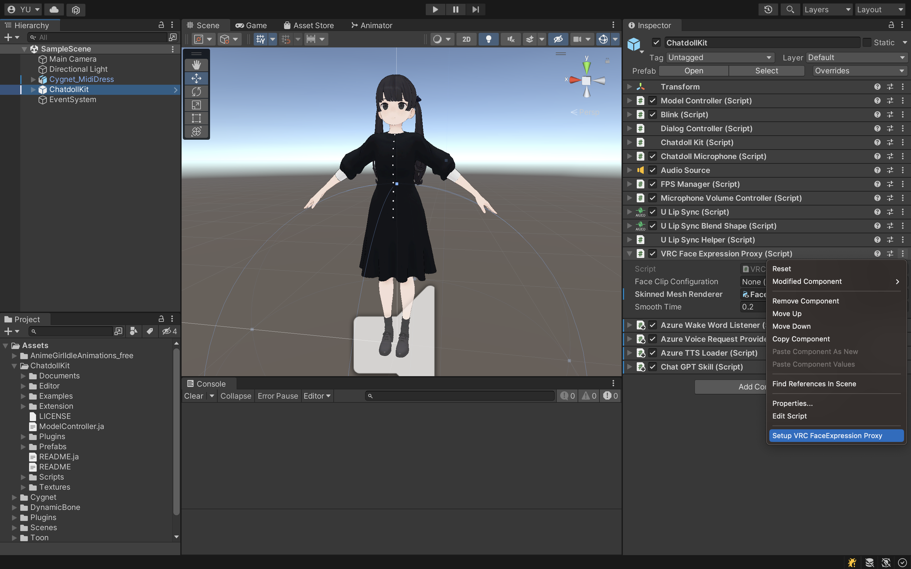

表情はFace Clip Configurationを直接編集することもできますし、VRCFaceExpressionProxyのインスペクターで現在の表情（シェイプキーを操作して作り込んだもの）をキャプチャーすることもできます。

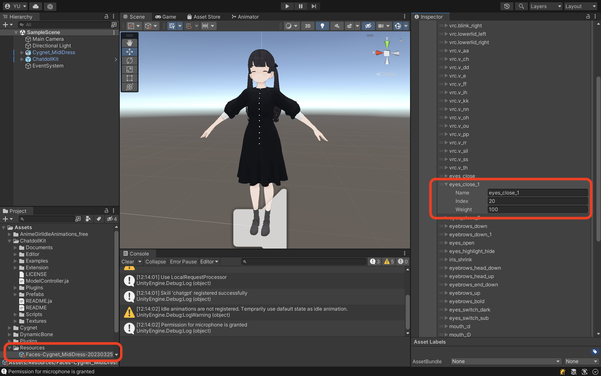


## 🥳 動作確認

UnityのPlayボタンを押します。3Dモデルがまばたきをしながらアイドル時のアニメーションを行っていることが確認できたら、以下のように会話をしてみましょう。

- `Wake Word`に設定した文言を話しかける（例：こんにちは）
- `Prompt Voice`に設定した文言で応答（例：どうしたの？）
- 話しかけたい言葉をしゃべる（例：これはテストです）
- 話しかけた言葉と同じ内容を応答

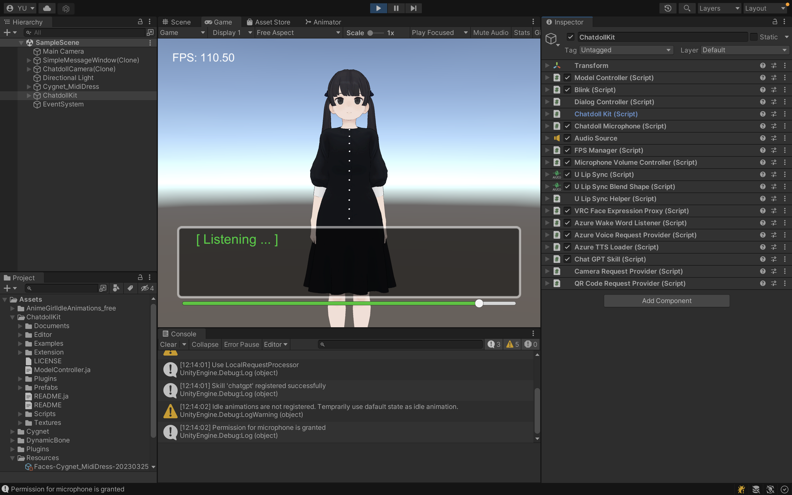


# 🌊 Use Azure OpenAI Service

Azure OpenAI Serviceを利用するには、ChatGPTServiceコンポーネントのインスペクター上で以下の通り設定してください。

1. 設定情報を含むエンドポイントURLを`Chat Completion Url`に設定
```
format: https://{your-resource-name}.openai.azure.com/openai/deployments/{deployment-id}/chat/completions?api-version={api-version}
```

2. API Keyを`Api Key`に設定

3. `Is Azure`にチェックを入れる

NOTE: インスペクターで設定した`Model`は無視され、URLに含まれているモデルが使用されます。


# 👷‍♀️ カスタムアプリケーションの作り方

Examplesに同梱の`MultiSkills`の実装サンプルを参考にしてください。

- 対話のルーティング：`Router`には、発話内容からユーザーが話したいトピックを選択するロジックの例が実装されています
- 対話の処理：`TranslateDialog`をみると、リクエスト文言を利用して翻訳APIを叩き、結果を応答する一連の例が実装されています

ChatdollKitを利用した複雑で実用的なバーチャルアシスタントの開発方法については、現在コンテンツを準備中です。


# 🌐 WebGLでの実行

さしあたっては以下のTipsを参考にしてください。加えてWebGL用のデモを公開予定です。

- ビルドに5-10分くらいかかる。（マシンスペックによる）
- デバッグがとても大変。どこでエラーが起きたのか、ログには表示されない: `To use dlopen, you need to use Emscripten’s linking support, see https://github.com/kripken/emscripten/wiki/Linking` 
- C#標準の Async/Await が利用できない（そこでコードが止まる）。JavaScriptがシングルスレッドなことに依存していると思われる。かわりに [UniTask](https://github.com/Cysharp/UniTask) を利用しましょう
- WebGLアプリのホスト先と異なるドメインとHTTP通信するにはCORSへの対応が必要
- Unity標準のマイクは動作しない。ネイティブ・WebGL双方で意識せず利用できる`ChatdollMicrophone`を使いましょう
- MP3などの圧縮音源の再生ができない。TTSLoader（読み上げ）のフォーマットをWaveにしましょう
- OVRLipSyncが動作しない。かわりに [uLipSync](https://github.com/hecomi/uLipSync) と [uLipSyncWebGL](https://github.com/uezo/uLipSyncWebGL) との組み合わせを使いましょう
- 日本語等のマルチバイト文字を表示したいとき、それが含まれるフォントをプロジェクトに同梱する必要がある。メッセージウィンドウが標準でArialなので、これをM+など別のものに変更しましょう


# ❤️ 謝辞

ChatdollKitでは以下のすばらしい素材・ツールを利用させていただいており、心から感謝申し上げます。

- [uLipSync](https://github.com/hecomi/uLipSync) (LipSync) (c)[hecomi](https://twitter.com/hecomi)
