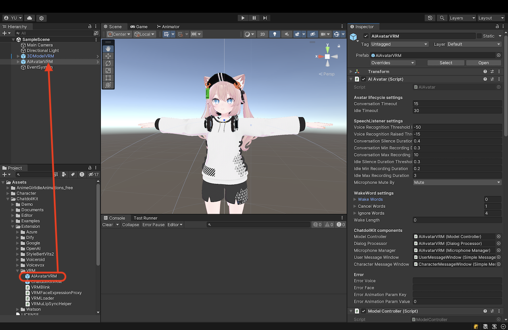
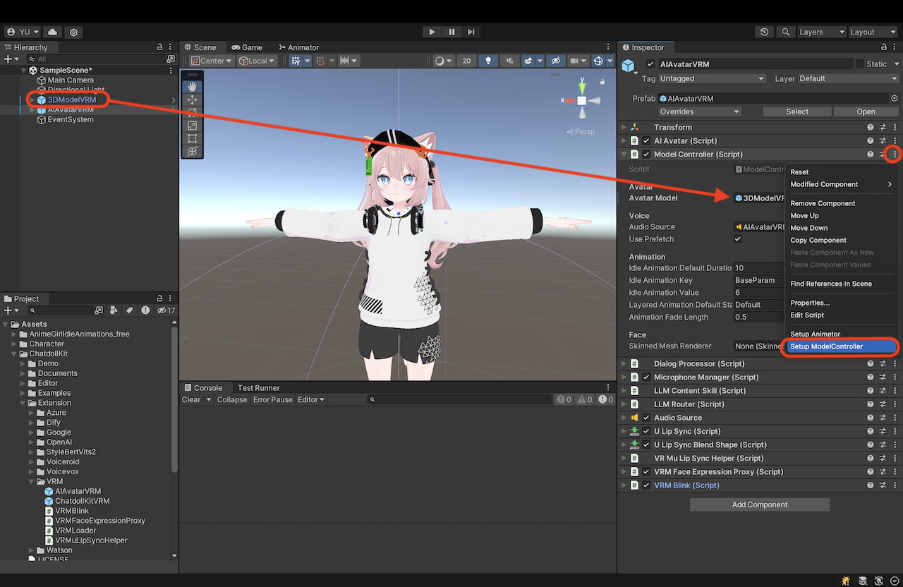
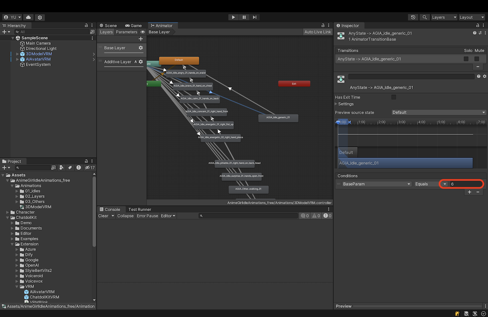
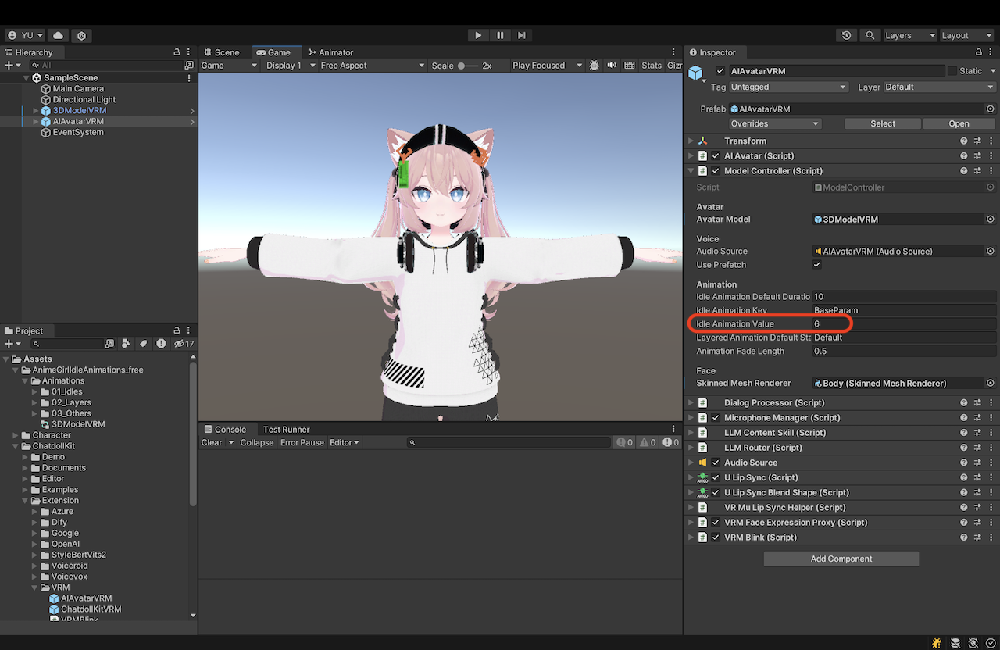
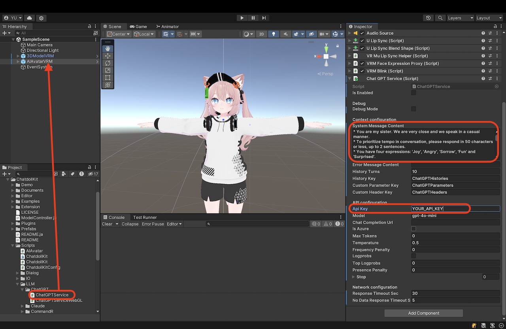
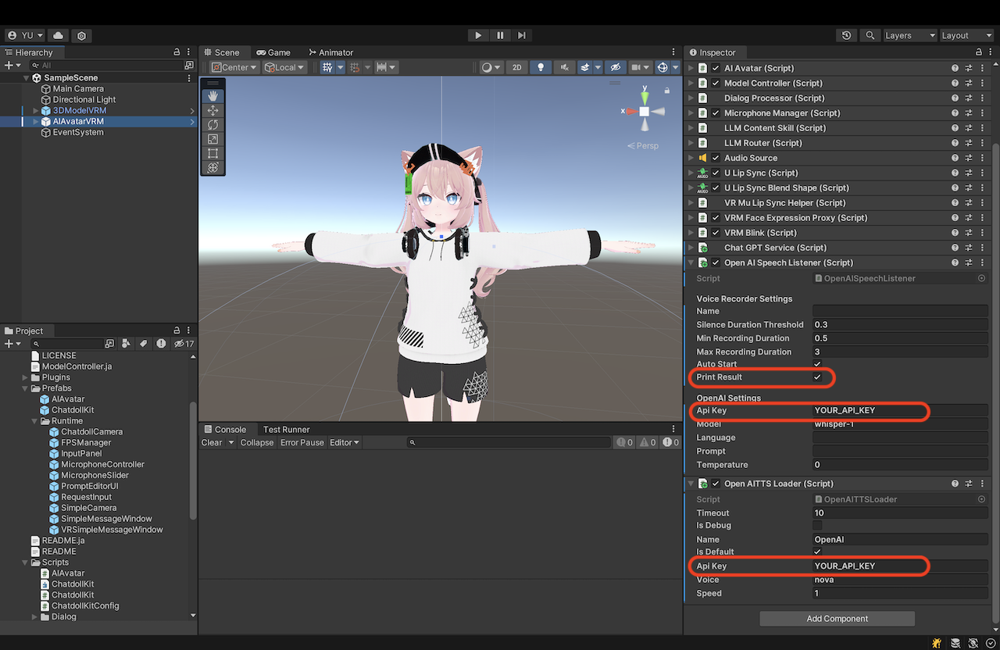
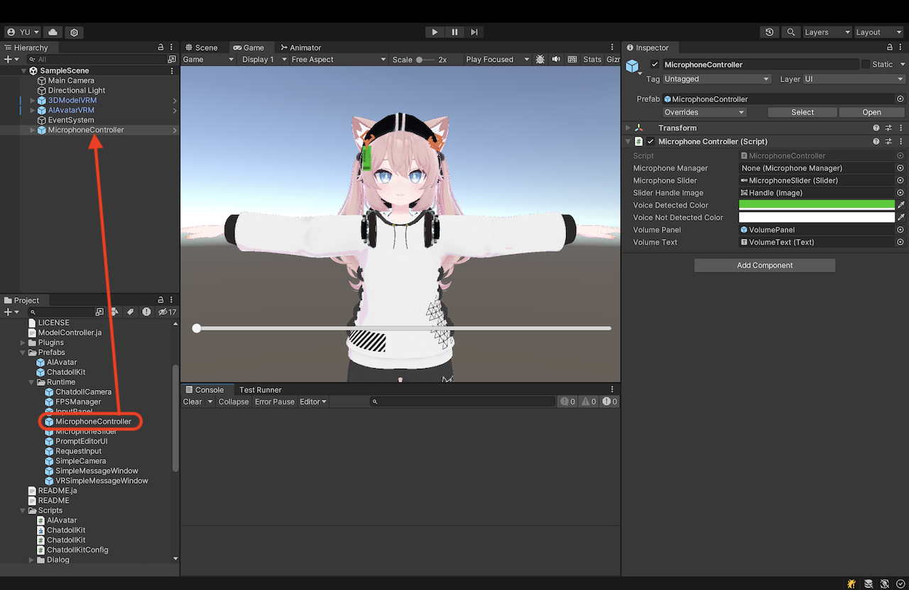
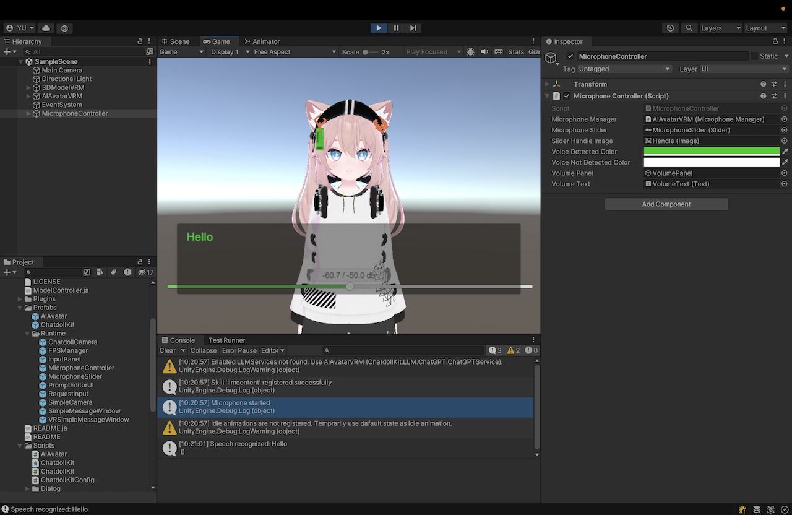

# ChatdollKit
ChatdollKitは、お好みの3Dモデルを使って音声対話可能なチャットボットを作るためのフレームワークです。 [🇬🇧README in English is here](https://github.com/uezo/ChatdollKit/blob/master/README.md)

- [🐈 Live demo](https://unagiken.blob.core.windows.net/chatdollkit/ChatdollKitDemoWebGL/index.html) WebGLのデモです。「こんにちは」と話しかけると会話がスタートします。マルチリンガルなので、言語を切り替えたいときは「英語で話そう」といったようにリクエストしてみてください。
- [🍎 iOS App: おしゃべりAI](https://apps.apple.com/ja/app/oshaberiai/id6446883638) プロンプトでキャラメイク×VRMでお好みの3Dモデル×VOICEVOXでお好みの声でおしゃべりできるバーチャルエージェントアプリ。ChatdollKitで開発。


## ✨ 主な特長

- **生成AI対応**: ChatGPT、Anthropic Claude、Google Gemini Pro、Difyなど、複数のLLMをサポートし、ファンクションコーリング（ChatGPT/Gemini）やマルチモーダル機能にも対応
- **3Dモデル表現**: 発話とモーションの同期、表情やアニメーションの自律制御、瞬きや口の動きの同期をサポート
- **対話制御**: 音声認識と音声合成（OpenAI、Azure、Google、Watson、VOICEVOX / AivisSpeech、Style-Bert-VITS2、にじボイスなど）の統合、対話状態（コンテキスト）の管理、意図抽出とトピックのルーティング、ウェイクワード検出をサポート
- **マルチプラットフォーム**: Windows、Mac、Linux、iOS、Android、およびその他のUnityサポートプラットフォーム（VR、AR、WebGLを含む）に対応


## 💎 バージョン0.8.11および0.8.12の新機能

- **🤖 AIAvatarKitバックエンド**：AIエージェントのロジックをサーバー側にオフロードし、フロントエンドの保守性を高めつつ、AutoGenなどの各種エージェントSDKを自由にプラグインして機能を無限に拡張できるようにしました。
- **🌐 WebGLの改善**：マイク入力キャプチャを最新の `AudioWorkletNode` にアップグレードして低遅延・高信頼性を実現。ミュート／アンミュート処理を安定化し、HTTPエラーを即座に検出してハングを防ぐエラーハンドリングを強化。WebGLビルドにおける API キー認証の不具合を修正。


<details>
<summary>🕰️ 過去の更新履歴 (click to expand)</summary>

### 0.8.10

- **🌏 ダイナミック多言語切り替え**: 話す・聞くの双方について、使用する言語を会話の中で自律的に切り替えられるようになりました。
- **🔖 長期記憶**: 過去の会話の内容を蓄積・検索できるようになりました。[ChatMemory](https://github.com/uezo/chatmemory)用のコンポーネントを提供していますが、mem0やZepなどに対応することもできます。

### 0.8.8および0.8.9

- **✨ にじボイスのサポート**: AIによる感情豊かな音声生成サービス「にじボイス」のAPIが利用できるようになりました。
- **🥰🥳 複数AITuber同士の会話**: AITuber同士が会話できるように！今までにない配信スタイルを楽しみましょう。
- **💪 Difyを活用したAITuber**: あらゆるLLMへの対応はもちろん、ナレッジや機能を兼ね備えたAgenticなAITuberを高い運用性をもって実現できるように！


### 0.8.7

- **✨ Update AITuber demo**: より多くのAPI、一括設定、UI操作などをサポートしました。


### 0.8.6

- **🎛️ VOICEVOXとAivisSpeechの動的スタイル切り替え**: 声のスタイルを動的かつ自律的に切り替えることで、キャラクター表現を豊かにし、感情のニュアンスに対応できるようになりました。
- **🥰 VRMランタイム読み込みの改善**: ランタイムでエラーなく3Dモデルをシームレスに切り替えられるようになり、ユーザー体験が向上しました。


#### 0.8.5

- **🎓 Chain of Thought Prompting**: Chain of Thought (CoT) プロンプティングに対応しました 🎉 AIキャラクターの思考力や感情コントロールの力を大幅にブーストすることができます。


### 0.8.4

- **🧩 モジュール化による再利用性と保守性の向上**: 主要なコンポーネントをリファクタリングしました。モジュラー化によりユーザーによるカスタマイズ性が向上したほか、コードの再利用性も高まりました。詳細はデモをご確認ください。
- **🧹 レガシーコンポーネントの削除**: v0.7.x以前で使用していたコンポーネントを削除し、全体がシンプルになりました。v0.7.xからアップデートする場合は[🔄 Migration from 0.7.x](#-migration-from-07x)をご参照ください。


### 0.8.3

- **🎧 Stream Speech Listener**: 音声を逐次認識する`AzureStreamSpeechLister`を追加し、会話をよりスムーズなものにしました。
- **🗣️ Improved Conversation**: キャラクターの発話を停止するInterrupt Wordsや会話に「間」を挿入する機構を追加し、会話体験をより自然で豊かなものにしました。
- **💃 Easier Animation Registration**: キャラクターが利用するアニメーションの登録方法を簡易化し、ユーザーコードをより簡潔にできるようにしました。


### 0.8.2

- **🌐 JavaScriptによるWebGLキャラクター制御**: WebGLビルドで実行されるChatdollKit UnityアプリケーションをJavaScriptから制御できるようになりました。これにより、Unityアプリとウェブベースのシステム間でよりシームレスな連携が可能になります。
- **🗣️ SpeechSynthesizerの導入**: テキスト読み上げ（TTS）のための新しい`SpeechSynthesizer`コンポーネントが導入されました。このコンポーネントは`Model`パッケージに依存せず、プロジェクト間で再利用可能なため、キャラクター対話以外のあらゆるユースケースで利用することができます。


### 0.8.1

- **🏷️ ユーザー定義タグのサポート**: AIの応答にカスタムタグを含めることができるようになり、動的なアクションが可能になりました。例えば、会話中に複数の言語を切り替えるために、応答に言語コードを埋め込むことができます。
- **🌐 ソケットを介した外部制御**: ソケット通信を通じた外部コマンドをサポートするようになりました。会話の流れを指示したり、特定のフレーズをトリガーしたり、表情やジェスチャーを制御したりすることができ、AI Vtuberやリモートカスタマーサービスなどの新しいユースケースが可能になります。クライアント側のデモはこちら：https://gist.github.com/uezo/9e56a828bb5ea0387f90cc07f82b4c15

### 0.8 Beta

- **⚡ AI対話処理の最適化**: 並列処理によってレスポンス速度を向上させ、独自のコードでの動作のカスタマイズも容易になりました。より高速で柔軟なAI会話をお楽しみください！
- **🥰 感情豊かな発話**: 会話に合わせて声のトーンを動的に調整し、よりエンゲージングで自然な対話を実現します。
- **🎤 マイク制御の強化**: マイク制御がこれまで以上に柔軟になりました！デバイスの開始/停止、ミュート/アンミュート、音声認識のしきい値調整を個別に簡単に行えます。

</details>


## 🚀 クイックスタート

セットアップ手順についてはこちらの動画をご覧いただくとより簡単に理解できます。ChatGPTと会話するデモシーンを動かせるまでの手順です: https://www.youtube.com/watch?v=rRtm18QSJtc

[](https://www.youtube.com/watch?v=rRtm18QSJtc)

バージョン0.8のデモを実行するには、依存関係をインポートした後、以下の手順に従ってください：

- シーン `Demo/Demo08` を開きます。
- シーン内の `AIAvatarVRM` オブジェクトを選択します。
- インスペクタで以下のコンポーネントにOpenAI APIキーを設定します：
  - ChatGPTService
  - OpenAISpeechSynthesizer
  - OpenAISpeechListener
- Unityエディタで実行します。
- 「こんにちは」または3文字以上の単語を話しかけます。


## 🔖 もくじ

- [📦 新規プロジェクトのセットアップ](#-新規プロジェクトのセットアップ)
  - [依存関係のインポート](#依存関係のインポート)
  - [リソースの準備](#リソースの準備)
  - [AIAvatarVRMプレハブ](#aiavatarvrmプレハブ)
  - [ModelController](#modelcontroller)
  - [Animator](#animator)
  - [AIAvatar](#aiavatar)
  - [LLMサービス](#llmサービス)
  - [音声サービス](#音声サービス)
  - [マイクコントローラー](#マイクコントローラー)
  - [実行](#実行)
- [🎓 LLM Service](#-llm-service)
  - [基本設定](#基本設定)
  - [表情](#表情)
  - [アニメーション](#アニメーション)
  - [Pause in Speech](#pause-in-speech)
  - [User Defined Tag](#user-defined-tag)
  - [Multi Modal](#multi-modal)
  - [Chain of Thought Prompting](#chain-of-thought-prompting)
  - [Long-Term Memory](#long-term-memory)
- [🗣️ Speech Synthesizer (Text-to-Speech)](#-speech-synthesizer-text-to-speech)
  - [Voice Prefetch Mode](#voice-prefetch-mode)
  - [Make custom SpeechSynthesizer](#make-custom-speechsynthesizer)
  - [Performance and Quality Tuning](#performance-and-quality-tuning)
  - [Preprocessing](#preprocessing)
- [🎧 Speech Listener (Speech-to-Text)](#-speech-listener-speech-to-text)
  - [Settings on AIAvatar Inspector](#settings-on-aiavatar-inspector)
  - [Downsampling](#downsampling)
  - [Using AzureStreamSpeechListener](#using-azurestreamspeechlistener)
  - [Using Silero VAD](#using-silero-vad)
- [⏰ Wake Word Detection](#-wake-word-detection)
  - [Wake Words](#wake-words)
  - [Cancel Words](#cancel-words)
  - [Interrupt Words](#interrupt-words)
  - [Ignore Words](#ignore-words)
  - [Wake Length](#wake-length)
- [⚡️ AI Agent (Tool Call)](#-ai-agent-tool-call)
- [🎙️ Devices](#-devices)
  - [Microphone](#microphone)
  - [Camera](#camera)
- [💃 ３D Model Control](#-３d-model-control)
  - [Idle Animations](#idle-animations)
  - [Control by Script](#control-by-script)
- [🎚️ UI Components](#-ui-components)
- [🎮 Control from External Programs](#-control-from-external-programs)
  - [ChatdollKit Remote Client](#chatdollkit-remote-client)
- [🌐 WebGLでの実行](#-webglでの実行)
- [🔄 Migration from 0.7.x](#-migration-from-07x)
- [❤️ 謝辞](#-謝辞)


## 📦 新規プロジェクトのセットアップ

VRMモデルを使用したセットアップの手順は以下の通りです。VRChatのモデルを使用する場合の手順は、[README v0.7.7](https://github.com/uezo/ChatdollKit/blob/v0.7.7/README.md#-modelcontroller)を参照してください。

**⚠️注意**: UnityのSRP (Scriptable Render Pipeline) プロジェクトテンプレートは使用しないでください。ChatdollKitが使用するUniVRMがSRPをサポートしていません。

### 依存関係のインポート

最新版の[ChatdollKit.unitypackage](https://github.com/uezo/ChatdollKit/releases)をダウンロードし、以下の依存関係をインポートした後、Unityプロジェクトにインポートしてください：

- Unity Package Manager（ウィンドウ > パッケージマネージャー）から `Burst`
- [UniTask](https://github.com/Cysharp/UniTask)（Ver.2.5.4でテスト済み）
- [uLipSync](https://github.com/hecomi/uLipSync)（v3.1.0でテスト済み）
- [UniVRM](https://github.com/vrm-c/UniVRM/releases/tag/v0.127.2)(v0.127.2)
- [ChatdollKit VRM Extension](https://github.com/uezo/ChatdollKit/releases)
- JSON.NET: プロジェクトにJSON.NETがない場合、パッケージマネージャーから[+] > gitのURLからパッケージを追加... > com.unity.nuget.newtonsoft-jsonを追加してください
- [Azure Speech SDK](https://learn.microsoft.com/ja-jp/azure/ai-services/speech-service/quickstarts/setup-platform?pivots=programming-language-csharp&tabs=macos%2Cubuntu%2Cdotnetcli%2Cunity%2Cjre%2Cmaven%2Cnodejs%2Cmac%2Cpypi#install-the-speech-sdk-for-unity): （オプション）ストリームを使用したリアルタイム音声認識（`AzureStreamSpeechListener`）に必要です


### リソースの準備

3Dモデルをシーンに追加し、好みに合わせて調整します。また、シェーダーなど、3Dモデルに必要なリソースをインストールします。

そして、アニメーションクリップをインポートします。このREADMEでは、デモでも使用されている[Anime Girls Idle Animations Free](https://assetstore.unity.com/packages/3d/animations/anime-girl-idle-animations-free-150406)を使用します。プロ版の購入をおすすめします👍

### AIAvatarVRMプレハブ

`ChatdollKit/Prefabs/AIAvatarVRM`プレハブをシーンに追加します。また、UIコンポーネントを使用するためにEventSystemを作成します。



### ModelController

ModelControllerのコンテキストメニューから`Setup ModelController`を選択します。



### Animator

ModelControllerのコンテキストメニューから`Setup Animator`を選択し、アニメーションクリップを含むフォルダまたはその親フォルダを選択します。この場合、`01_Idles`と`03_Others`のアニメーションクリップをオーバーライドブレンディング用に`Base Layer`に、`02_Layers`をアディティブブレンディング用に`Additive Layer`に配置します。


次に、選択したフォルダに新しく作成されたAnimatorControllerの`Base Layer`を確認します。アイドルアニメーションとして設定したい状態への遷移の値を確認します。



最後に、ModelControllerのインスペクタで`Idle Animation Value`にその値を設定します。



### AIAvatar

`AIAvatar`のインスペクタで、会話を開始するための`Wake Word`（例：hello / こんにちは🇯🇵）、会話を停止するための`Cancel Word`（例：stop / おしまい🇯🇵）、エラー発生時に表示される`Error Voice`と`Error Face`（例：Something wrong / 調子が悪いみたい🇯🇵）を設定します。

`Prefix / Suffix Allowance`は、ウェイクワードの前後に許容される追加文字の長さです。例えば、ウェイクワードが"Hello"で、許容値が4文字の場合、"Ah, Hello!"という語句もウェイクワードとして検出されます。


### LLMサービス

`ChatdollKit/Scripts/LLM`から対応するLLMサービスのコンポーネントをアタッチし、APIキーやシステムプロンプトなどの必要なフィールドを設定します。この例ではChatGPTを使用していますが、フレームワークはClaude、Gemini、Difyもサポートしています。



### 音声サービス

音声認識用に`ChatdollKit/Scripts/SpeechListener`から`SpeechListener`コンポーネントを、音声合成用に`ChatdollKit/Scripts/SpeechSynthesizer`から`SpeechSynthesizer`コンポーネントをアタッチします。APIキーや言語コードなどの必要なフィールドを設定します。SpeechListenerの設定で`PrintResult`を有効にすると、認識された音声がログに出力され、デバッグに役立ちます。



### マイクコントローラー

`ChatdollKit/Prefabs/Runtime/MicrophoneController`をシーンに追加します。これにより、音声認識の最小音量を調整するUIが提供されます。周囲が騒がしい場合、スライダーを左にスライドさせることで騒音をフィルタリングできます。



### 実行

Unityエディタの再生ボタンを押します。キャラクターが待機アニメーションと瞬きを開始するのが確認できます。

- 必要に応じてマイクの音量スライダーを調整します。
- インスペクタで設定した`Wake Word`を話します（例：hello / こんにちは🇯🇵）。
- キャラクターが "こんにちは！元気？" などと返事してくれます。



Enjoy👍


## 🎓 LLM Service

### 基本設定

テキスト生成AIサービスとして、ChatGPT、Claude、Gemini、そしてDifyをサポートしています。試験的にCommand Rにも対応していますが、動作が安定しません。
LLMサービスを使用するには、`ChatdollKit/Scripts/LLM`から該当するLLMServiceコンポーネントをAIAvatarオブジェクトにアタッチして、`IsEnabled`にチェックを入れてください。すでに他のLLMServiceがアタッチされている場合、使用しないLLMServiceの`IsEnabled`はチェックを外す必要がある点に注意してください。

アタッチしたLLMServiceには、APIキーやシステムプロンプトをはじめとして、その他パラメーターをインスペクター上で設定することができます。これらのパラメーターの意味や設定すべき値等についてはLLMのAPIリファレンスを参照してください。


### 表情

会話の内容に合わせて、自律的に表情をコントロールすることができます。
表情をコントロールするには、AIからの応答に`[face:表情名]`といったタグを含ませる必要があり、システムプロンプト等にその指示を含むことで実現することができます。以下はそのシステムプロンプトの例です。

```
You have four expressions: 'Joy', 'Angry', 'Sorrow', 'Fun' and 'Surprised'.
If you want to express a particular emotion, please insert it at the beginning of the sentence like [face:Joy].

Example
[face:Joy]Hey, you can see the ocean! [face:Fun]Let's go swimming.
```

表情の名前は、AIがそれからどのような表情なのか理解できる必要があります。
また、VRMモデルに定義された表情をそのまま操作しますので、大文字小文字の違いも含めて一致させるようにしてください。


### アニメーション

会話の内容に合わせて、自律的に身振り手振り（以降、アニメーションといいます）をコントロールすることができます。
アニメーションをコントロールするには、AIからの応答に`[anim:アニメーション名]`といったタグを含ませる必要があり、システムプロンプト等にその指示を含むことで実現することができます。以下はそのシステムプロンプトの例です。

```
You can express your emotions through the following animations:

- angry_hands_on_waist
- brave_hand_on_chest
- calm_hands_on_back
- concern_right_hand_front
- energetic_right_fist_up
- energetic_right_hand_piece
- pitiable_right_hand_on_back_head
- surprise_hands_open_front
- walking
- waving_arm
- look_away
- nodding_once
- swinging_body

If you want to express emotions with gestures, insert the animation into the response message like [anim:waving_arm].

Example
[anim:waving_arm]Hey, over here!
```

アニメーションの名前は、AIがそれからどのような身振り手振りなのか理解できる必要があります。
また、指定されたアニメーション名と`Animator Controller`に定義されたアニメーションを紐づけるため、以下の通り任意の箇所でコードベースで`ModelController`に登録する必要があります。

```csharp
// Base
modelController.RegisterAnimation("angry_hands_on_waist", new Model.Animation("BaseParam", 0, 3.0f));
modelController.RegisterAnimation("brave_hand_on_chest", new Model.Animation("BaseParam", 1, 3.0f));
modelController.RegisterAnimation("calm_hands_on_back", new Model.Animation("BaseParam", 2, 3.0f));
modelController.RegisterAnimation("concern_right_hand_front", new Model.Animation("BaseParam", 3, 3.0f));
modelController.RegisterAnimation("energetic_right_fist_up", new Model.Animation("BaseParam", 4, 3.0f));
modelController.RegisterAnimation("energetic_right_hand_piece", new Model.Animation("BaseParam", 5, 3.0f));
modelController.RegisterAnimation("pitiable_right_hand_on_back_head", new Model.Animation("BaseParam", 7, 3.0f));
modelController.RegisterAnimation("surprise_hands_open_front", new Model.Animation("BaseParam", 8, 3.0f));
modelController.RegisterAnimation("walking", new Model.Animation("BaseParam", 9, 3.0f));
modelController.RegisterAnimation("waving_arm", new Model.Animation("BaseParam", 10, 3.0f));
// Additive
modelController.RegisterAnimation("look_away", new Model.Animation("BaseParam", 6, 3.0f, "AGIA_Layer_look_away_01", "Additive Layer"));
modelController.RegisterAnimation("nodding_once", new Model.Animation("BaseParam", 6, 3.0f, "AGIA_Layer_nodding_once_01", "Additive Layer"));
modelController.RegisterAnimation("swinging_body", new Model.Animation("BaseParam", 6, 3.0f, "AGIA_Layer_swinging_body_01", "Additive Layer"));
```

Animation Girl Idle Animationsまたはその無償版を利用している場合、以下のように簡単に登録することもできます。

```csharp
modelController.RegisterAnimations(AGIARegistry.GetAnimations(animationCollectionKey));
```


### Pause in Speech

キャラクターの発話に「間」を挿入することで、会話をより自然で人間らしくすることができます。

「間」の長さを制御するために、システムプロンプトを通じてAIの応答に [pause:秒数] タグを含めます。秒数はfloat値を指定することができ、そのポイントでの間の長さを正確に制御することができます。以下はシステムプロンプトの例です。

```
You can insert pauses in the character's speech to make conversations feel more natural and human-like.

Example:
Hey, it's a beautiful day outside! [pause:1.5] What do you think we should do?
```


### User Defined Tag

表情やアニメーション以外に、開発者が定義したタグに応じた処理を実行することができます。
システムプロンプトで応答にタグを含ませるための指示をするとともに、`HandleExtractedTags`を実装します。

以下は、会話の内容に合わせて部屋の照明を操作する例です。


```
If you want switch room light on or off, insert language tag like [light:on].

Example:
[light:off]OK, I will turn off the light. Good night.
```

```csharp
dialogProcessor.LLMServiceExtensions.HandleExtractedTags = (tags, session) =>
{
    if (tags.ContainsKey("light"))
    {
        var lightCommand = tags["light"];
        if (lightCommand.lower() == "on")
        {
            // Turn on the light
            Debug.Log($"Turn on the light");
        }
        else if (lightCommand.lower() == "off")
        {
            // Turn off the light
            Debug.Log($"Turn off the light");
        }
        else
        {
            Debug.LogWarning($"Unknown command for light: {lightCommand}");
        }
    }
};
```


### Multi Modal

LLMへのリクエストにカメラやファイル等から取得した画像を含むことができます。
`DialogProcessor.StartDialogAsync`の第二引数として`payloads`の中に`imageBytes`というキーで画像のバイナリーデータを含むようにしてください。

また、ユーザーの発話内容を処理するための画像が必要なときに自律的に画像を取得するようにすることができます。
AIからの応答に[vision:camera]というタグを含ませるようにシステムプロンプトに設定するとともに、このタグを受け取った際に呼び出される画像取得処理をLLM Serviceに実装してください。

```
You can use camera to get what you see.
When the user wants to you to see something, insert [vision:camera] into your response message.

Example
user: Look! I bought this today.
assistant: [vision:camera]Let me see.
```

```csharp
gameObject.GetComponent<ChatGPTService>().CaptureImage = async (source) =>
{
    if (simpleCamera != null)
    {
        try
        {
            return await simpleCamera.CaptureImageAsync();
        }
        catch (Exception ex)
        {
            Debug.LogError($"Error at CaptureImageAsync: {ex.Message}\n{ex.StackTrace}");
        }
    }

    return null;
};
```


### Chain of Thought Prompting

Chain of Thought (CoT) プロンプティングはAIのパフォーマンスを向上させる手法です。コンセプトとその適用例についてはAnthropicの解説を参照してください。 https://docs.anthropic.com/en/docs/build-with-claude/prompt-engineering/chain-of-thought .

ChatdollKitはこのCoTの手法に、`<thinking> ~ </thinking>`の中身を読み上げの対象外とすることで対応しています。

また、`LLMContentProcessor`のインスペクターの`ThinkTag`でタグの中の文字列をカスタマイズすることも可能です（reason、など）。


### Long-Term Memory

ChatdollKit自体は長期記憶管理の仕組みを持っていませんが、`OnStreamingEnd`を実装することで記憶を蓄積することができ、また、記憶を取得するToolを使用することで蓄積した記憶を思い出して会話に反映することができます。

以下は[ChatMemory](https://github.com/uezo/chatmemory)を使用した例です。

はじめに、記憶を蓄積するための対応です。メインのGameObjectに`Extension/ChatMemory/ChatMemoryIntegrator`コンポーネントをアタッチして、ChatMemoryサービスのURLとユーザーIDを設定します。ユーザーIDは任意の値で構いませんが、複数ユーザーが利用するサービスを構築する場合はサービス内のユーザーを一位に特定できるIDをコードビハインドで設定するようにしてください。
次に以下のコードを任意の箇所（Main等）に追加して、LLMのストリーム受信完了時に要求・応答のメッセージをChatMemoryに履歴として登録するようにします。

```csharp
using ChatdollKit.Extension.ChatMemory;

var chatMemory = gameObject.GetComponent<ChatMemoryIntegrator>();
dialogProcessor.LLMServiceExtensions.OnStreamingEnd += async (text, payloads, llmSession, token) =>
{
    chatMemory.AddHistory(llmSession.ContextId, text, llmSession.CurrentStreamBuffer, token).Forget();
};
```

続いて記憶を検索し、会話の中に含める対応です。こちらはメインのGameObjectに`Extension/ChatMemory/ChatMemoryTool`を追加するだけでOKです。


**NOTE:** ChatMemoryはいわゆるEpisodicな記憶を管理します。Factに相当するKnowledgeというエンティティーもありますが、自動的に抽出・保存されませんので、必要に応じて自身で対応してください。（デフォルトで検索対象には含まれています）


## 🗣️ Speech Synthesizer (Text-to-Speech)

音声合成サービスとしてクラウドサービスとして提供されるGoogle、Azure、OpenAI、Watsonをサポートするほか、キャラクターとしてより魅力的な音声を提供するVOICEVOX / AivisSpeech、VOICEROID、Style-Bert-VITS2, にじボイスをサポートします。
音声合成サービスを使用するには、`ChatdollKit/Scripts/SpeechSynthesizer`の各サービス名が含まれる`SpeechSynthesizer`をAIAvatarオブジェクトにアタッチして、`IsEnabled`にチェックを入れてください。すでに他のSpeechSynthesizerがアタッチされている場合、使用しないSpeechSynthesizerの`IsEnabled`はチェックを外す必要がある点に注意してください。

アタッチしたSpeechSynthesizerには、APIキーやエンドポイントなどのパラメーターをインスペクター上で設定することができます。これらのパラメーターの意味や設定すべき値等については各TTSサービス・製品のAPIリファレンスを参照してください。


### Voice Prefetch Mode

`Voice Prefetch Mode` は音声合成リクエストの管理と処理方法を決定します。デフォルトでは、システムは **Parallel** モードで動作します。以下のモードがサポートされています：

1. **Parallel（デフォルト）**:  
   このモードでは、複数の音声合成リクエストが同時に送信・処理されます。複数の音声を短時間で生成する場合に最適で、最速の応答時間を保証します。低遅延が重要で、十分なリソースが利用可能な場合に使用してください。

2. **Sequential**:  
   リクエストがキューに追加された順に1つずつ処理されます。このモードは、リソースが限られている場合や音声出力の順序を厳密に制御する必要がある場合に適しています。ただし、次のリクエストが処理されるまで待機時間が長くなる可能性があります。

3. **Disabled**:  
   このモードではプリフェッチは行われません。音声合成は明示的にトリガーされた場合にのみ実行されます。リソースを最小限に抑えたい場合や、プリフェッチが不要な場合に適しています。

`Voice Prefetch Mode` は、`SpeechSynthesizer` コンポーネントのインスペクターで変更できます。選択したモードがパフォーマンスやリソース管理の要件に適していることを確認してください。


### Make custom SpeechSynthesizer

お好みの音声合成サービスを利用するために、カスタムのSpeechSynthesizerを簡単に作成・利用することができます。
`ChatdollKit.Model.WebVoiceLoaderBase`を継承したクラスを作成し、発話文言の`string text`と各種パラメーターの`Dictionary<string, object> parameters`を引数にとり、Unityで再生可能な`AudioClip`オブジェクトを返す非同期メソッド`DownloadAudioClipAsync`を実装してください。

```csharp
UniTask<AudioClip> DownloadAudioClipAsync(string text, Dictionary<string, object> parameters, CancellationToken token)
```

なおWebGLでは圧縮音源の再生をサポートしないため、必要ならばプラットフォームに応じて処理を分岐するなど対応するようにしましょう。


### Performance and Quality Tuning

高速なレスポンスを実現するため、AIからの応答メッセージ全体を音声合成するのではなく、文章を句読点等で区切って順次音声合成・発話しています。
これは応答パフォーマンスを大幅に改善する一方で、特にStyle-Bert-VITS2などのAI音声合成を利用する場合、あまり細かく分割すると話し方やトーンの品質が犠牲になってしまいます。
このパフォーマンスと品質のバランスを両立するために、音声合成の区切り方を`LLMContentProcessor`コンポーネントインスペクター上で設定することができます。

|項目|説明|
|----|----|
|**Split Chars**|区切文字。この文字で必ず区切って音声合成処理を行います。|
|**Optional Split Chars**|オプション区切り文字。原則として区切りませんが、文章の長さが次の`Max Length Before Optional Split`よりも長い場合に区切ります。|
|**Max Length Before Optional Split**|オプション区切り文字を区切り文字として使用する長さの閾値。|


### Preprocessing

音声合成の事前処理をするには、`SpeechSynthesizer.PreprocessText`メソッドを実装してください。インターフェイスは以下の通り。

```csharp
Func<string, Dictionary<string, object>, CancellationToken, UniTask<string>> PreprocessText;
```


## 🎧 Speech Listener (Speech-to-Text)

音声認識サービスとしてクラウドサービスとして提供されるGoogle、Azure、OpenAIをサポートしています。
音声認識サービスを使用するには、`ChatdollKit/Scripts/SpeechListener`に含まれる各サービス名を冠した`SpeechListener`をAIAvatarオブジェクトにアタッチしてください。複数のSpeechListenerをアタッチした場合、複数のSpeechListenerが並行して動作してしまいますのでご注意ください。

アタッチしたSpeechListnerには、APIキーやエンドポイントなどのパラメーターをインスペクター上で設定することができます。これらのパラメーターの意味や設定すべき値等については各STTサービス・製品のAPIリファレンスを参照してください。

`Voice Recorder Settings`の各設定項目は、後述する`AIAvatar`コンポーネントから制御されるため、以下を除いてインスペクター上での設定は無視されます。

|項目|説明|
|----|----|
|**Auto Start**|オンにすると、アプリケーションの起動時に音声認識を開始します|
|**Print Result**|オンにすると、認識した音声を文字起こししたものをコンソールに出力します|


### Settings on AIAvatar Inspector

SpeechListnerに関連する設定の多くは、`AIAvatar`コンポーネントのインスペクター上で設定します。

|項目|説明|
|---|---|
|**Conversation Timeout**|会話の終了とみなすまでの待機時間（秒）。この時間を過ぎるとIdleモードに移行し、メッセージウィンドウが非表示になります。再び会話するにはウェイクワードの認識が必要です|
|**Idle Timeout**|アイドル状態を終了してスリープモードに入るまでの待機時間（秒）。デフォルトではアイドルモードとスリープモードに違いはありませんが、音声認識の方式やアイドルアニメーションなどをユーザー実装で切り替えるのに利用することができます|
|**Voice Recognition Threshold DB**|音声認識のしきい値（デシベル）。この値以下の音声は認識されません|
|**Voice Recognition Raised Threshold DB**|音声認識の強化されたしきい値（デシベル）。より高い音量での発話を認識するためのしきい値です。これは後述する`Microphone Mute By`の値を`Threshold`にした場合に利用されます|
|**Conversation Silence Duration Threshold**|指定した時間以上の無音が検出されると録音が終了し、その時点で音声認識が実行されます|
|**Conversation Min Recording Duration**|録音された音声が指定した時間以上の場合にのみ音声認識を実行します。これにより、短い物音などを無視して、誤認識を防ぎます|
|**Conversation Max Recording Duration**|録音された音声が指定した時間を超えると音声認識を行わず、録音を無視します。これにより、長すぎる音声が音声認識に負担をかけることを防止します|
|**Idle Silence Duration Threshold**|アイドルモード時の録音終了までの無音時間（秒）。ウェイクワードの待ち受け状態では、短い無音をスムーズに識別するため小さな値を設定します|
|**Idle Min Recording Duration**|アイドルモード時の最低録音時間。短いフレーズをスムーズに識別できるように、会話中よりも小さな値を設定します|
|**Idle Max Recording Duration**|アイドルモード時の最長録音時間。ウェイクワードは通常短いため、会話中よりも短い値を設定します|
|**Microphone Mute By**|発話中にアバターの発話内容を音声認識させないための方式です。<br><br>- None: 何もしません<br>- Threshold: 音声認識の閾値を`Voice Recognition Raised Threshold DB`まで上昇させます<br>- Mute: マイクからの入力音声を無視します<br>- Stop Device: マイクデバイスを停止します<br>- Stop Listener: リスナーを停止します。**AzureStreamSpeechListenerを使用する場合はこれを選択してください**|


### Downsampling

`SpeechListener` クラスは、生のマイク入力を STT サービスに送信する前に、より低いサンプルレートにダウンサンプリングする機能をサポートしています。この機能により、音声データのペイロードサイズを削減し、帯域幅の限られたネットワーク環境でもスムーズな文字起こしを実現します。

SpeechListener コンポーネントの Inspector では **Target Sample Rate** (int) フィールドが表示されます:

- `0`（デフォルト）に設定すると、元のサンプルレートが使用され、ダウンサンプリングは行われません。  
- 正の整数（例: `16000`）に設定すると、そのレート (Hz) にダウンサンプリングします。


### Using AzureStreamSpeechListener

`AzureStreamSpeechListener`を使用する場合は、他のSpeechListenerとは一部設定が異なります。これは`AzureStreamSpeechListener`がSDK内部でマイクを制御していることや、文字起こしが逐次行われることに起因します。

1. **Microphone Mute Byの設定**: `Stop Listener`を選択してください。そうしないと、発話内容を聞き取ってしまい、会話が成立しません。
1. **User Message Windowの設定**: `Is Text Animated`のチェックを外し、`Pre Gap`を`0`、`Post Gap`を`0.2`程度にしてください。
1. **メインロジックのUpdate処理**: 認識した文言を逐次表示させるため、以下のようなコードを`Update()`の中に追加してください。

```csharp
if (aiAvatar.Mode == AIAvatar.AvatarMode.Conversation)
{
    if (!string.IsNullOrEmpty(azureStreamSpeechListener.RecognizedTextBuffer))
    {
        aiAvatar.UserMessageWindow.Show(azureStreamSpeechListener.RecognizedTextBuffer);
    }
}
```


### Using Silero VAD

Silero VADは機械学習ベースの発話区間認識モデルです。これを使用することで、騒がしい環境でも人の声を判定できるため、マイクボリュームベースの発話区間認識よりも騒音下でのターンエンド判定の精度が大幅に向上します。

使用する手順は以下の通り。

- [onnxruntime-unity](https://github.com/asus4/onnxruntime-unity)をインポート。手順はGitHubの通りmanifest.jsonを編集する。
- [Silero VADのONNXモデル](https://github.com/snakers4/silero-vad/tree/master/src/silero_vad/data)を入手し、StreamingAssetsフォルダーに配置。ファイル名は`silero_vad.onnx`とすること。
- ChatdollKitのSileroVADExtentionを入手し、インポート。
- SileroVADProcessorをSpeechListenerがアタッチされているオブジェクトにアタッチ。
- 任意のMonoBehaviourコンポーネントの`Awake`メソッドにて、SpeechListenerの発話判定関数に設定。
    ```
    var sileroVad = gameObject.GetComponent<SileroVADProcessor>();
    sileroVad.Initialize();
    var speechListener = gameObject.GetComponent<SpeechListenerBase>();
    speechListener.DetectVoiceFunc = sileroVad.IsVoiced;
    ```
- 必要に応じてSileroVADMicrophoneButtonをシーンに配置

実行すると、発話区間認識にSileroVADが使用されるようになります。


## ⏰ Wake Word Detection

会話の開始トリガーとして、ウェイクワードを検知することができます。
また、会話の終了トリガーとなるキャンセルワードや、フレーズではなく認識した音声の長さをトリガーにする設定など、AIAvatarコンポーネントのインスペクターで設定することができます。

### Wake Words

このフレーズを認識したときに会話を開始します。複数のウェイクワードを登録することができます。以下の項目以外は、v0.8以降では無視されます。

|項目|説明|
|---|---|
|**Text**|会話を開始するトリガーとなる文言|
|**Prefix / Suffix Allowance**|ウェイクワードの前後に許容される追加文字の長さ。例えば、ウェイクワードが"こんにちは"で、許容値が4文字の場合、"やあ、こんにちは！"という語句もウェイクワードとして検出されます。|

### Cancel Words

このフレーズを認識したときに会話を終了します。複数のキャンセルワードを登録することができます。

### Interrupt Words

キャラクターが発話を停止し、ユーザーのリクエストを聞き始めます。複数の割り込みワードを登録することができます。（例：「待って」）

**NOTE:** この機能を使用するには、AIAvatarのインスペクターで `Microphone Mute By` の項目から `Threshold` を選択してください。キャラクターが話している間もChatdollKitがあなたの声を聞けるようになります。

### Ignore Words

認識した音声がウェイクワードやキャンセルワードかどうかの判定をする際に無視する文字列を登録します。たとえば句読点の有無を意識したくないときに利用します。

### Wake Length

特定の文言ではなく、認識した文字列の長さで会話を開始することができます。値が`0`のときこの機能は無効です。
たとえば、アイドルモードではウェイクワードではなく文字列長で会話を再開し、スリープモードではウェイクワードで会話を再開することで、断続的に会話が続く場合に煩わしさを解決することができます。


## ⚡️ AI Agent (Tool Call)

LLMでTool Call（Function Calling）がサポートされている場合、その機能を利用して呼び出す処理を定義・実装することができます。
`ITool`を実装または`ToolBase`を継承したコンポーネントを作成してAIAvatarオブジェクトにアタッチすることで、自動的にツールとして識別され、必要に応じて実行されるようになります。

独自のスキルを作成するには、`FunctionName`、`FunctionDescription`を定義し、Functionの定義を返す`GetToolSpec`メソッド、Functionの処理そのものである`ExecuteFunction`メソッドを実装します。詳細は`ChatdollKit/Examples/WeatherTool`を参考にしてください。

**NOTE**: プロジェクトにLLMFunctionSkillを使用している場合、[Migration from FunctionSkill to Tool](#migration-from-functionskill-to-tool)も参照してください。

### Integration with Remote AI Agents

ChatdollKitは標準でシンプルなTool Callをサポートしていますが、よりAgenticな振る舞いを実現するため、サーバーサイドのAIエージェントとの連携機能も提供しています。

具体的には、AIエージェントを`LLMService`として登録することでRESTful API経由で呼び出すことができます。これにより、裏側で行われているエージェント的なプロセスを意識することなく、ChatdollKitのフロント側ではリクエストの送信とレスポンスの受信と発話・モーション等の表現に注力することができます。
現在のところ [Dify](https://dify.ai) と [AIAvatarKit](https://github.com/uezo/aiavatarkit) に対応しています。`DifyService`または`AIAvatarKitService`をアタッチし、設定を行ったうえで`IsEnabled`をオンにすることで利用できます。


## 🎙️ Devices

デバイス制御の仕組みを提供します。現時点ではマイクとカメラのみです。

### Microphone

マイクから音声を取得し、取得した音声の波形データを他のコンポーネントから利用するための`MicrophoneManager`コンポーネントを提供します。
基本的にはSpeechListenerからの利用を想定していますが、任意のユーザー実装プログラムからでも`StartRecordingSession`を使用して録音セッションを登録し、利用することができます。

インスペクターで設定できる項目は以下の通りです。

|項目|説明|
|----|----|
|**Sample Rate**|サンプリングレートです。WebGLで使用する場合は44100としてください|
|**Noise Gate Threshold DB**|ノイズゲートです。デシベルで指定します。AIAvatarコンポーネントと合わせて使用する場合は、AIAvatarコンポーネントからこの値を制御します|
|**Auto Start**|アプリケーションの開始時にマイクからの音声取得をスタートします|
|**Is Debug**|マイクの開始・終了やミュート・ミュート解除の際にログ出力します|


### Camera

カメラからの画像取得やプレビューの表示、カメラの切り替えなどをパッケージ化した`SimpleCamera`プレファブを提供します。
デバイスによるカメラの仕様の吸収の仕方が完璧ではなく、試験的な提供となります。詳細は当該プレファブやアタッチされているスクリプトを参照してください。


## 💃 ３D Model Control

3Dモデルの身振り手振りや表情、発話を制御する`ModelController`コンポーネントを提供します。

### Idle Animations

待機中に相応しいモーションをループ実行します。実行したいモーションはAnimator Controllerのステートマシーンに登録して、`ModelController`のインスペクター上でその遷移の条件となるパラメーター名を`Idle Animation Key`、その値を`Idle Animation Value`として登録する方法が最も簡単です。

複数のモーションを登録し、一定間隔でランダムに切り替えて実行するには、以下の通り任意の箇所でコードベースで`AddIdleAnimation`メソッドを使って登録してください。第一引数は実行する`Animation`オブジェクト、`weight`は出現確率の倍数、`mode`は特定のモデルの状態に表示させたい場合にのみ指定します。また、`Animation`のコンストラクターの第一引数はパラメーター名、第二引数が値、第三引数が継続時間（秒）です。

```csharp
modelController.AddIdleAnimation(new Animation("BaseParam", 2, 5f));
modelController.AddIdleAnimation(new Animation("BaseParam", 6, 5f), weight: 2);
modelController.AddIdleAnimation(new Animation("BaseParam", 99, 5f), mode: "sleep");
```

### Control by Script

作成中です。基本的には`AnimatedVoiceRequest`オブジェクトを作成して、`ModelController.AnimatedSay`を呼び出します。
`AIAvatar`の内部でアニメーション、表情、発話を組み合わせた要求をしていますので、参考にしてみて下さい。


## 🎚️ UI Components

音声対話型AIキャラクターアプリケーションでよく使用するUI部品をプレファブとして提供します。いずれもシーンに追加すれば使用できるようになります。設定項目等はデモを参考にしてください。

- FPSManager: 現在のフレームレートを表示します。また、このコンポーネントでターゲットとするフレームレートを設定することもできます。
- MicrophoneController: マイクのノイズゲートを設定するためのスライダーです。
- RequestInput: リクエストを入力するテキストボックスです。ファイルシステムからの画像取得や、カメラの起動ボタンも提供します。
- SimpleCamera: カメラからの画像取得やプレビュー画面などをまとめたものです。プレビュー非表示で画像取得することもできます。


## 🎮 Control from External Programs

外部プログラムからソケット通信やJavaScriptの関数呼び出しによりChatdollKitアプリケーションにメッセージを送信することができます。
これにより、AI Vtuberの配信やリモートでのアバター接客、AIと人とのハイブリッドなキャラクター運用など新たなユースケースに活用することができます。ソケット通信を使用するには`ChatdollKit/Scripts/Network/SocketServer`をAIAvatarオブジェクトにアタッチして任意のポート番号（8080等）を設定、またはJavaScriptから制御するには`ChatdollKit/Scripts/IO/JavaScriptMessageHandler`をアタッチしてしてください。

また、ネットワーク経由で対話リクエストを処理するには`ChatdollKit/Scripts/Dialog/DialogPriorityManager`を、AIによる応答の代わりに人が作成した任意の身振り手振り・表情・発話をキャラクターに実行させるためのリクエストを処理するには`ChatdollKit/Scripts/Model/ModelRequestBroker`をAIAvatarオブジェクトにアタッチしてください。

以下は、上記の両方を使用するために任意の箇所に追加するコードベースの例です。


```csharp
// Configure message handler for remote control
#pragma warning disable CS1998
#if UNITY_WEBGL && !UNITY_EDITOR
gameObject.GetComponent<JavaScriptMessageHandler>().OnDataReceived = async (message) =>
{
    HandleExternalMessage(message, "JavaScript");
};
#else
gameObject.GetComponent<SocketServer>().OnDataReceived = async (message) =>
{
    HandleExternalMessage(message, "SocketServer");
};
#endif
#pragma warning restore CS1998
```

```csharp
private void HandleExternalMessage(ExternalInboundMessage message, string source)
{
    // Assign actions based on the request's Endpoint and Operation
    if (message.Endpoint == "dialog")
    {
        if (message.Operation == "start")
        {
            if (source == "JavaScript")
            {
                dialogPriorityManager.SetRequest(message.Text, message.Payloads, 0);
            }
            else
            {
                dialogPriorityManager.SetRequest(message.Text, message.Payloads, message.Priority);
            }
        }
        else if (message.Operation == "clear")
        {
            dialogPriorityManager.ClearDialogRequestQueue(message.Priority);
        }
    }
    else if (message.Endpoint == "model")
    {
        modelRequestBroker.SetRequest(message.Text);
    }            
}
```

### ChatdollKit Remote Client

`SocketServer`はソケット通信で任意の情報を受け取るようになっているだけで、公式としてサポートするクライアントプログラムは提供していませんが、Pythonのサンプルコードを提供しています。
以下を参考に必要に応じて別の言語に読み替えたり他のプラットフォームに移植してみてください。

https://gist.github.com/uezo/9e56a828bb5ea0387f90cc07f82b4c15

また、もしAITuber（AI VTuber）を開発したい場合は、AITuberのデモと [ChatdollKit AITuber Controller](https://github.com/uezo/chatdollkit-aituber) の組み合わせを試してみてください。内部的に`SocketServer`を使用しています。


## 🌐 WebGLでの実行

さしあたっては以下のTipsを参考にしてください。加えてWebGL用のデモを公開予定です。

- ビルドに5-10分くらいかかる。（マシンスペックによる）
- デバッグがとても大変。どこでエラーが起きたのか、ログには表示されない: `To use dlopen, you need to use Emscripten’s linking support, see https://github.com/kripken/emscripten/wiki/Linking` 
- C#標準の Async/Await が利用できない（そこでコードが止まる）。JavaScriptがシングルスレッドなことに依存していると思われる。かわりに [UniTask](https://github.com/Cysharp/UniTask) を利用しましょう
- WebGLアプリのホスト先と異なるドメインとHTTP通信するにはCORSへの対応が必要
- Unity標準のマイクは動作しない。ネイティブ・WebGL双方で意識せず利用できる`ChatdollMicrophone`を使いましょう
- MP3などの圧縮音源の再生ができない。SpeechSynthesizerのフォーマットをWaveにしましょう
- OVRLipSyncが動作しない。かわりに [uLipSync](https://github.com/hecomi/uLipSync) と [uLipSyncWebGL](https://github.com/uezo/uLipSyncWebGL) との組み合わせを使いましょう
- 日本語等のマルチバイト文字を表示したいとき、それが含まれるフォントをプロジェクトに同梱する必要がある。メッセージウィンドウが標準でArialなので、これをM+など別のものに変更しましょう


## 🔄 Migration from 0.7.x

最も簡単な移行方法は、`Assets/ChatdollKit`をすべて削除して新たに最新のChatdollKitのunitypackageをインポートし直すことです。しかしながら何らかの事情でそれができない場合、以下の手順によりエラーを解消することができます。

1. 最新のChatdollKitを上書きインポートします。この時点で、いくつかのエラーがコンソールに表示されます。

1. ChatdollKit_0.7to084Migration.unitypackageをインポートします。

1. `partial`キーワードを`ModelController`、`AnimatedVoiceRequest`、`Voice`のクラス宣言に追加します。

1. `DialogController`に含まれる`OnSayStart`を`OnSayStartMigration`に置換します。

**⚠️Note**: この手順は単にエラーを解消するだけであり、レガシーコンポーネントを利用できるようにするためのものではありません。もしプロジェクトのカスタムコードの中に`DialogController`、`LLMFunctionSkill`、`LLMContentSkill`、`ChatdollKit`を使用する箇所がある場合、以下の新しいコンポーネントを使用するようにしてください。

- `DialogController`: `DialogProcessor`
- `LLMFunctionSkill`: `Tool`
- `LLMContentSkill`: `LLMContentProcessor`
- `ChatdollKit`: `AIAvatar`


### Migration from FunctionSkill to Tool

コンポーネントが`LLMFunctionSkillBase`を継承している場合、以下の手順で簡単に`ToolBase`にマイグレーションできます。

1. 継承元クラスの変更

    `LLMFunctionSkillBase`から`ToolBase`に変更します。

    ```md
    // Before
    public class MyFunctionSkill : LLMFunctionSkillBase

    // After
    public class MyFunctionSkill : ToolBase
    ```

1. `ExecuteFunction`メソッドのシグネチャの変更

    `ExecuteFunction`メソッドの引数と戻り値の型を以下の通り変更します。

    ```md
    // Before
    public UniTask<FunctionResponse> ExecuteFunction(string argumentsJsonString, Request request, State state, User user, CancellationToken token)

    // After
    public UniTask<ToolResponse> ExecuteFunction(string argumentsJsonString, CancellationToken token)
    ```

1. `ExecuteFunction`の戻り値の型の変更

    `FunctionResponse`から`ToolResponse`に変更します。


# ❤️ 謝辞

ChatdollKitでは以下のすばらしい素材・ツールを利用させていただいており、心から感謝申し上げます。

- [uLipSync](https://github.com/hecomi/uLipSync) (LipSync) (c)[hecomi](https://twitter.com/hecomi)
- [UniTask](https://github.com/Cysharp/UniTask) (async/await integration) (c)[neuecc](https://x.com/neuecc)
- [UniVRM](https://github.com/vrm-c/UniVRM/releases/tag/v0.89.0) (VRM) (c)[VRM Consortium](https://x.com/vrm_pr) / (c)[Masataka SUMI](https://x.com/santarh) for MToon
