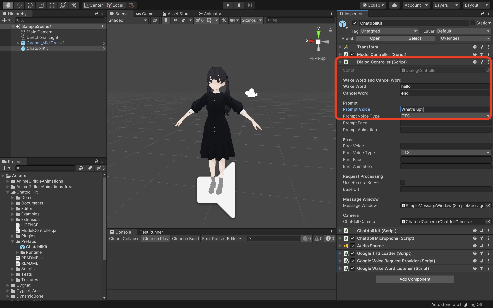

# ChatdollKit
ChatdollKit enables you to make your 3D model into a voice-enabled chatbot. [🇯🇵日本語のREADMEはこちら](https://github.com/uezo/ChatdollKit/blob/master/README.ja.md)

- [🇬🇧 Live demo English](https://uezo.blob.core.windows.net/github/chatdollkit/demo_en/index.html) Say "Hello" to start conversation. This demo just returns what you say (echo).
- [🇯🇵 Live demo in Japanese](https://uezo.blob.core.windows.net/github/chatdollkit/demo_ja/index.html)「こんにちは」と話しかけると会話がスタートします。会話がスタートしたら、雑談に加えて「東京の天気は？」などと聞くと天気予報を教えてくれます。

# ✨ Features

- Model
    - Speech and motion synchronization
    - Face expression control
    - Blink and lipsync

- Dialog
    - Speech-to-Text (Azure, Google, Watson etc)
    - Text-to-Speech (Azure, Google, Watson, VOICEROID, VOICEVOX etc)
    - Dialog state management
    - Intent extraction and topic routing

- I/O
    - Wakeword
    - Camera and QR Code

... and more! See [ChatdollKit Documentation](Documents/manual.md) to learn details.

# 🚀 Quick start

You can learn how to setup ChatdollKit by watching this 2 minutes video: https://www.youtube.com/watch?v=aJ0iDZ0o4Es

## 📦 Import packages

Download the latest version of [ChatdollKit.unitypackage](https://github.com/uezo/ChatdollKit/releases) and import it into your Unity project after import dependencies;

- [UniTask](https://github.com/Cysharp/UniTask)(Ver.2.3.1)
- [Oculus LipSync Unity](https://developer.oculus.com/downloads/package/oculus-lipsync-unity/)(v29)
- Only for Unity 2019 or ealier: [JSON .NET For Unity](https://assetstore.unity.com/packages/tools/input-management/json-net-for-unity-11347)
- If you want to create [Gatebox](https://www.gatebox.ai/en/) application also import [ChatdollKit Gatebox Extension](https://github.com/uezo/ChatdollKit/releases).

## 🐟 Resource preparation

Add 3D model to the scene and adjust as you like. Also install required resources for the 3D model like shaders, Dynamic Bone etc.
In this README, I use Cygnet-chan that we can perchase at Booth. https://booth.pm/ja/items/1870320

And, create `/Animations` folder and put animation clips.
In this README, I use [Anime Girls Idle Animations Free](https://assetstore.unity.com/packages/3d/animations/anime-girl-idle-animations-free-150406). I believe it is worth for you to purchase the pro edition.

## 🍣 ChatdollKit configuration

Add `ChatdollKit/Scripts/ChatdollKit` to the 3D model. Required components will also be added automatically.

Then, select the speech service (Azure/Google/Watson) you use and set API key and some properties like Region and BaseUrl on inspector of ChatdollKit.

### DialogController

On the inspector of `DialogController`, set `Wake Word` to start conversation, `Cancel Word` to stop comversation, `Prompt Voice` to require voice request from user.

### ModelController

Select `Setup ModelController` in the context menu of ModelController and set the name of shapekey for blink to `Blink Blend Shape Name` if it is not set after setup. If you want to setup manually, see [Appendix1. Setup ModelController manually](Documents/appendix.md#appendix-1-setup-modelcontroller-manually)

### Animator

Select `Setup Animator` in the context menu of ModelController and select the folder that contains animation clips. If subfolders are included, layers with the same name as the subfolders are created in the AnimatorController, and clips in each subfolders are put on each layers.

In this case you can select to put clips on `Base Layer` or create layers named `01_Idles`, `02_Layers` and `03_Others` and put on them.

After creating Animator Controller you can select default idle animation by editing `Default` status if you want to change.

If you want to setup manually, see [Appendix2. Setup Animator manually](Documents/appendix.md#appendix-2-setup-animator-manually)

## 🥳 Run

Press Play button of Unity editor. You can see the model starts with idling animation and blinking.

- Say the word you set to `Wake Word` on inspector (e.g. hello)
- Your model will reply the word you set to `Prompt Voice` on inspector (e.g. what's up?)
- Say something you want to echo like "Hello world!"
- Your model will reply "Hello world"

# 👷‍♀️ Build your own app

See the `MultiSkills` example. That is more rich application including:

- Dialog Routing: `Router` is an example of how to decide the topic user want to talk
- Processing dialog: `TranslateDialog` is an example that shows how to process dialog

We are now preparing contents to create more rich virtual assistant using ChatdollKit.

# 🌐 Run on WebGL

Refer to the following tips for now. We are preparing demo for WebGL.

- It takes 5-10 minutes to build. (It depends on machine spec)
- Very hard to debug. Error message doesn't show the stacktrace: `To use dlopen, you need to use Emscripten’s linking support, see https://github.com/kripken/emscripten/wiki/Linking` 
- Built-in Async/Await doesn't work (app stops at `await`) because JavaScript doesn't support threading. Use [UniTask](https://github.com/Cysharp/UniTask) instead.
- CORS required for HTTP requests.
- Microphone is not supported. Use `ChatdollMicrophone` that is compatible with WebGL.
- Compressed audio formats like MP3 are not supported. Use WAV in TTS Loaders.
- OVRLipSync is not supported. Use [uLipSync](https://github.com/hecomi/uLipSync) and [uLipSyncWebGL](https://github.com/uezo/uLipSyncWebGL) instead.
- If you want to show multibyte characters in message window put the font that includes multibyte characters to your project and set it to message windows.

# ❤️ Thanks

- [Tsukuyomi-chan 3D model](https://tyc.rei-yumesaki.net/) (3D model for demo) (c)[Rei Yumesaki](https://twitter.com/TYC_Project)
- [uLipSync](https://github.com/hecomi/uLipSync) (LipSync) (c)[hecomi](https://twitter.com/hecomi)
- [VOICEVOX](https://voicevox.hiroshiba.jp) (Text-to-Speech service for demo) (c)[Hiroshiba](https://twitter.com/hiho_karuta)
- [Shikoku Metan and Zundamon](https://zunko.jp/con_voice.html) (Voice for demo, used in VOICEVOX TTS loader)

Strictly follow the [Term of Use of Shikoku Metan and Zundamon](https://zunko.jp/con_ongen_kiyaku.html). And, if you distribute the voice generated with VOICEVOX let the users follow that rules.
